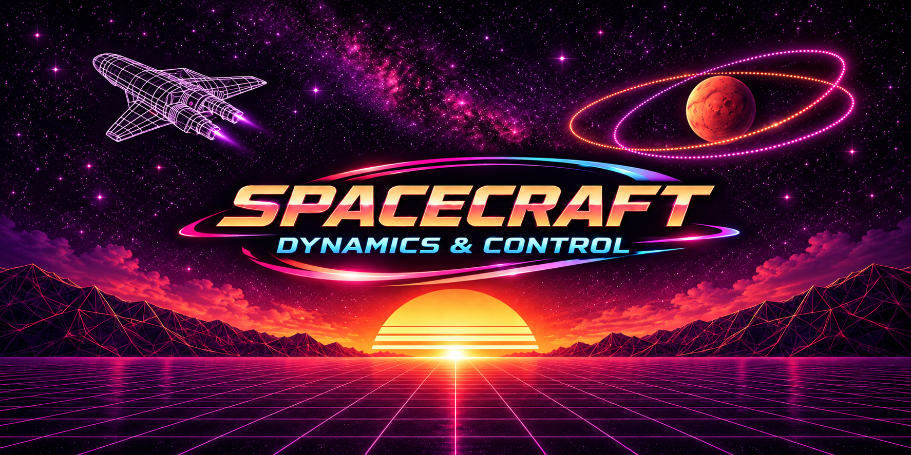

# 🛰️ Spacecraft Dynamics and Control

<p align="center">
  
</p>

<p align="center">
  <strong>
    A living technical reference and engineering sandbox for spacecraft dynamics,
    GNC, astrodynamics, relative motion, and simulation.
  </strong>
</p>

---

## 👋 What Is This?

This repository started when I began working as a GNC engineer and quickly
realized that "learning GNC" was not going to be a short side quest.

What initially looked like a manageable collection of dynamics and control
topics rapidly expanded into attitude representations, nonlinear control,
orbital mechanics, estimation, numerical methods, relative motion, simulation,
and software engineering.

Around the same time, I began working through the University of Colorado
Boulder's spacecraft dynamics and control courses. Jupyter notebooks became a
natural way to combine

$$
\text{Intuition}
\rightarrow
\text{Mathematics}
\rightarrow
\text{Code}
\rightarrow
\text{Visualization}.
$$

The original goal was simple: build a technical reference that future me could
return to instead of repeatedly relearning the same material.

Git added version control, portability, and a record of how the work evolved.
Keeping the repository public also meant that engineers, researchers, principal
investigators, collaborators, and potential employers could inspect the work
directly rather than rely only on a list of claimed skills.

Since then, I have learned that other students and engineers entering AOCS,
GNC, astrodynamics, and spacecraft dynamics have been following and using parts
of the material as well.

So the repository has gradually become something between a **personal
engineering notebook, technical reference, public learning record, and
spacecraft GNC laboratory**.

The rabbit hole, as it turns out, has its own reference frame.

---

## 🧭 Philosophy

The general approach I try to follow is

$$
\text{Physical Intuition}
\rightarrow
\text{Mathematical Formulation}
\rightarrow
\text{Implementation}
\rightarrow
\text{Verification}
\rightarrow
\text{Simulation}.
$$

Getting the correct equation is useful.

Understanding **where it came from, what assumptions it depends on, what frame
it lives in, how to implement it, and how to recognize when the implementation
is wrong** is considerably more useful.

Where appropriate, the notebooks therefore combine analytical derivations with
symbolic mathematics, numerical experiments, visualizations, simulations, and
engineering sanity checks.

---

## 🌱 A Working Engineering Record

This is deliberately not a perfectly polished textbook.

Older notebooks may be rougher than newer ones. Code gets refactored,
explanations improve, assumptions get questioned, and occasionally past me was
far more confident than present me would recommend.

The notebooks and Git commit history therefore preserve part of my development
as an engineer:

$$
\text{Learn}
\rightarrow
\text{Implement}
\rightarrow
\text{Test}
\rightarrow
\text{Refine}.
$$

That progression is part of the repository, not something I intend to edit
away.

---

# 🗂️ Repository Contents

## 📚 01 — Spacecraft Dynamics and Control Specialization

Foundational spacecraft mechanics and control, including:

- particle and rigid-body kinematics;
- reference frames and coordinate transformations;
- attitude representations;
- rigid-body kinetics;
- torque-free motion;
- gravity-gradient dynamics;
- momentum exchange devices;
- nonlinear stability and Lyapunov theory;
- nonlinear spacecraft attitude control;
- a Mars spacecraft dynamics and control capstone.

These notebooks began as course notes but have increasingly been developed as
long-term technical references.

---

## 🚀 02 — Advanced Spacecraft Dynamics and Control Specialization

Advanced spacecraft dynamics and control material building on the foundations
of the first specialization.

This section is actively being developed and will progressively cover more
advanced spacecraft dynamics, actuation, guidance, and control problems.

---

## 🛰️ 03 — Spacecraft Formation and Relative Orbits Specialization

Orbital mechanics and spacecraft relative-motion material, including:

- Keplerian motion;
- reference-frame kinematics;
- rotating-frame dynamics;
- variation of parameters;
- spacecraft formation flying;
- bounded relative motion.

A major objective here is to understand how relative-motion equations arise
from the underlying mechanics rather than treating them as formulas to
memorize.

---

## 🧮 `AttitudeKinematicsLib`

A reusable Python library containing implementations of common spacecraft
attitude representations and transformations, including:

- Direction Cosine Matrices (DCMs);
- Euler angles;
- Principal Rotation Vectors (PRVs);
- Euler-Rodrigues Parameters / quaternions;
- Classical Rodrigues Parameters (CRPs);
- Modified Rodrigues Parameters (MRPs).

The library grew naturally from repeatedly implementing and verifying the same
mathematics while studying spacecraft kinematics.

Future work includes stronger automated testing and systematic verification of
mathematical invariants.

---

## 🧪 `BASILISK-X`

`BASILISK-X` is my spacecraft simulation and experimentation workspace built on
the [Basilisk](https://github.com/AVSLab/basilisk) astrodynamics framework
developed by the AVS Laboratory at the University of Colorado Boulder.

Current experiments include:

- basic orbital propagation;
- nadir-pointing attitude control;
- cooperative GEO rendezvous;
- Vizard visualization utilities.

Areas intended for future experimentation include:

- relative orbital motion;
- rendezvous and proximity operations;
- formation flying;
- spacecraft phasing;
- finite-thrust manoeuvres;
- navigation and state estimation;
- mission logic and autonomy;
- Monte Carlo and sensitivity studies.

> **BASILISK-X is not a replacement for Basilisk.**
>
> Basilisk provides the underlying simulation engine, dynamics models,
> flight-software modules, message architecture, numerical infrastructure, and
> many of the algorithms used by these simulations.
>
> BASILISK-X is where I use that infrastructure to learn, integrate systems,
> build scenarios, conduct engineering studies, and develop reusable utilities.

See [`BASILISK-X/README.md`](./BASILISK-X/README.md) for further details.

---

## 🔬 `studies/`

Independent engineering investigations that do not necessarily belong to a
specific course module.

This is where the repository begins to move from studying established material
toward asking and investigating engineering questions independently.

Current studies include work involving:

- spacecraft attitude dynamics and control;
- Earth Orientation Parameters;
- engineering plotting and visualization tools.

---

## 📖 `AVS_reference/`

Selected reference implementations from the
[AVS Laboratory](https://hanspeterschaub.info/AVS-Code.html), retained for
comparison with spacecraft-dynamics formulations studied in this repository.

These files are reference material rather than original work, and the original
AVS Laboratory sources remain authoritative.

---

## 🌳 Full Repository Structure

A complete repository tree is automatically generated and maintained in:

[`STRUCTURE.md`](./STRUCTURE.md)

For most visitors, starting with one of the major sections above will probably
be considerably less traumatic.

---

# ⚙️ Getting Started

Clone the repository:

```bash
git clone https://github.com/johnm3398/Spacecraft-Dynamics-and-Control.git
cd Spacecraft-Dynamics-and-Control
```

Most of the learning material is contained in Jupyter notebooks and can be
opened using JupyterLab, Jupyter Notebook, or VS Code.

Different sections of the repository serve different purposes and may have
different dependencies. There is therefore currently no single environment
intended to execute every file in the repository.

### BASILISK-X

For the Basilisk-based simulation workspace:

```bash
cd BASILISK-X
python -m pip install "bsk[all,examples]==2.11.1"
python -m pip install -e .
```

Further setup information is available in
[`BASILISK-X/README.md`](./BASILISK-X/README.md).

---

# 🤝 Feedback, Corrections, and Collaboration

One consequence of keeping this work public is that other people can question
it, which I consider a feature rather than a bug.

Spacecraft dynamics has more than enough reference frames, sign conventions,
notation choices, assumptions, and implementation details for mistakes to
occasionally survive longer than they should.

If you spot something that appears incorrect, unclear, inconsistent, or worth
improving, please feel free to raise a GitHub issue.

**Constructive technical criticism is very welcome.**

I am also open to hearing from students, engineers, researchers, and others
working on related problems. If you have an interesting idea for a study,
simulation, implementation, or collaboration, feel free to get in touch.

And if something here has helped you understand a concept or solve a problem,
I would genuinely enjoy hearing about that too.

---

# 📚 References and Attribution

A significant portion of the theoretical foundation of this repository is
influenced by the work of **Hanspeter Schaub** and **John L. Junkins**,
particularly:

> Hanspeter Schaub and John L. Junkins  
> *Analytical Mechanics of Space Systems*, Fourth Edition  
> AIAA Education Series

Many of the learning notebooks also build upon material from the University of
Colorado Boulder's spacecraft dynamics, control, and relative-motion courses.

This repository is **not a reproduction of those resources**. The notebooks
represent my own study notes, derivations, explanations, implementations,
visualizations, numerical experiments, and extensions developed while learning
and applying the material.

Basilisk-based work is separately attributed to the
[AVS Laboratory](https://github.com/AVSLab/basilisk), which develops and
maintains the Basilisk simulation framework.

Where material from other textbooks, papers, software projects, or technical
references is used substantially, the corresponding original source should be
treated as authoritative and credited accordingly.

---

# 🤖 Use of AI-Assisted Tools

**AI-assisted tools are used selectively in the development of this repository
to accelerate discussion, learning, note-taking, documentation, and software
development. They are not treated as the technical authority behind the work.**

In practice, I may use AI as a technical sounding board to:

- debate or challenge my understanding of a concept;
- explore alternative interpretations or approaches;
- organize thoughts while working through a problem;
- help draft or refine Markdown and technical prose;
- accelerate note-taking and documentation;
- assist with debugging, refactoring, or code review;
- suggest ways of visualizing mathematical or physical concepts.

These tools accelerate parts of the workflow, but they do not replace the
engineering work itself.

**I remain the final authority on what is accepted into this repository.
Mathematical interpretation, engineering judgement, implementation choices,
verification, and technical conclusions are subject to my own review and due
diligence before they are incorporated or committed.**

AI-generated output is not considered correct simply because it was generated.
Where a technical claim depends on established theory, an algorithm, a physical
model, published research, software documentation, or a standard, the relevant
primary or authoritative source remains the reference of record.

$$
\text{AI Assistance}
\neq
\text{Technical Authority}.
$$

The intent is to use AI to **accelerate thinking and documentation, not
outsource understanding**.

Where practical, substantially AI-generated visual assets are identified as
such.

---

# 📖 Citing This Repository

If material from this repository contributes to your work, including code,
derivations, technical explanations, figures, visualizations, or numerical
studies, an acknowledgement or citation would be appreciated.

### Suggested Citation

> **John Gracious, _Spacecraft Dynamics and Control_, GitHub repository.**  
> https://github.com/johnm3398/Spacecraft-Dynamics-and-Control

For machine-readable citation metadata and additional citation formats, see
[`CITATION.cff`](./CITATION.cff). GitHub can also use this file through its
**Cite this repository** functionality.

When referring to a specific notebook, study, figure, or implementation,
linking to the relevant file or commit is encouraged so that the exact version
of the referenced material can be identified.

If adapting or redistributing source code from this repository, please also
follow the terms of the [`MIT License`](./LICENSE).

---

# ⚠️ Disclaimer

This repository is primarily an **educational, research, and engineering
experimentation workspace**.

Although care is taken to verify the mathematics and implementations, the
material should not be treated as certified flight software or flight-qualified
analysis without independent verification appropriate to the application.

If a real spacecraft is depending entirely on one of my Jupyter notebooks,
several project reviews have probably gone missing.

---

# 🚧 Status

This repository is actively developed.

Some sections are polished technical references. Others are active notebooks,
experiments, software prototypes, or works in progress. That is intentional.

The long-term objective is to progressively develop the repository into a
coherent spacecraft dynamics, GNC, astrodynamics, and simulation reference
while preserving the derivations, experiments, mistakes, corrections, and
reasoning that led there.

---

# 📄 License

Unless otherwise noted, original code in this repository is distributed under
the [`MIT License`](./LICENSE).

Third-party material remains subject to the licences, copyright, and terms of
its respective authors and projects.
